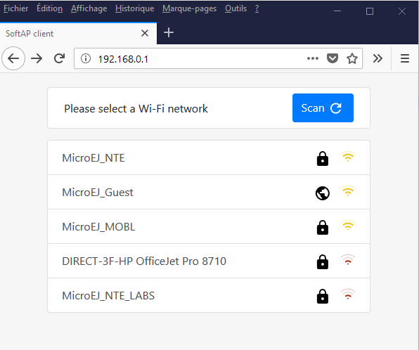
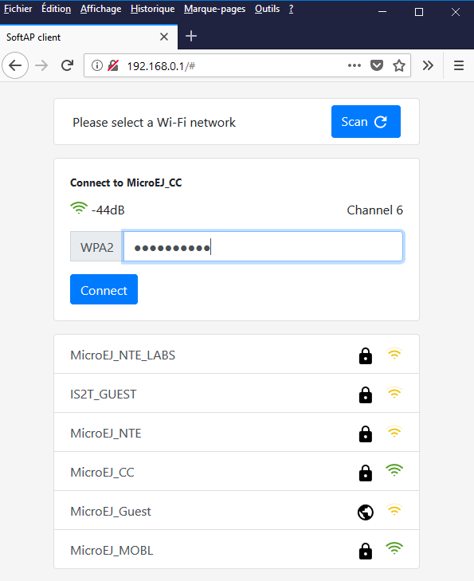
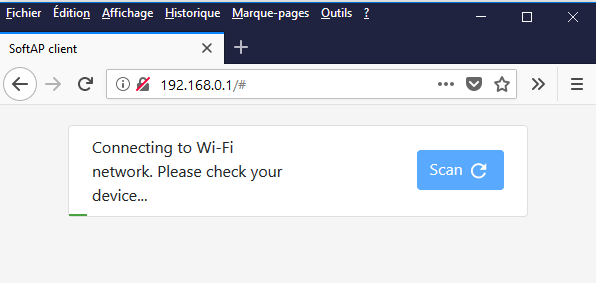

# Overview

This library mounts a rest server to provide the Access Point credential to join a Wi-Fi using different endpoints.

It also presents a HTTP page at */* and */index.html* to provide the Access Point Configuration

1. Display Wi-Fi networks accessible from the board.
    * 
2. Providing credential
    * 
3. Connecting
    * 

 
## Build Prerequisites

Ensure that the following project dependency are resolved:
   - com.microej.example.wifi.setup
   - com.microej.example.wifi.setup.rest
 
   
To provide this import the projects examples in your workspace then either:
   * Activate the ivy configuration `Resolve dependencies in workspace`.
     * Window -> Preferences
     * Ivy -> Class Path Container
     * Check `Resolve dependencies in workspace`
   * Build the projects using Easy Ant.

# Usage

See dependencies section to provide required libraries for build.

## Run

This example provides an entry point that can be run.
Configure the SoftAP configuration in [Main.java](src/main/java/com/microej/example/wifi/setup/web/Main.java)

### Build

1. Right Click on [Main.java](src/main/java/com/microej/example/wifi/setup/web/Main.java)
2. Select **Run as -> Run Configuration** 
3. Select **MicroEJ Application** configuration kind
4. Click on **New launch configuration** icon
5. In **Execution** tab
	1. In **Target** frame, in **Platform** field, select a relevant platform (but not a virtual device)
	2. In **Execution** frame
		1. Select **Execute on Device**
		2. In **Settings** field, select **Build & Deploy**
6. Press **Apply**
7. Press **Run**
8. Copy the generated `.out` file path

### Flash

1. Use the appropriate flashing tool.

## Execution flow

1. Read the standard output of the board (this is described in the Platform documentation).
2. Power up the board
   * A Wi-Fi network is provided by the board with the SSID and password definied in Main (default values: MicroEJ_SoftAP, qwertyuiop).
   * On the standard output, the trace `Server started on [ip]:[port]` is printed.
3. Using a third party device, connect to the board's Wi-FI.
4. Use a web browser to browse to `[ip]:[port]`.
5. Follow the Web Page instruction to connect to an Access Point.

## Depend on this project

Add the following line to your `module.ivy` or your `ivy.xml`:
> `<dependency org="com.microej.example.wifi" name="setup-web" rev="+"/>`

# Requirements

  - EDC-1.2 or higher
  - BON-1.2 or higher
  - NET-1.0 or higher
  - ECOM-WIFI-2.1 or higher
  - ECOM-NETWORK-2.0 or higher

# Dependencies

_All other dependencies are retrieved transitively by Ivy resolver_.

# Source

N/A

# Restrictions

None.

---  
_Markdown_   
_Copyright 2019-2023 MicroEJ Corp. All rights reserved._   
_Use of this source code is governed by a BSD-style license that can be found with this software._